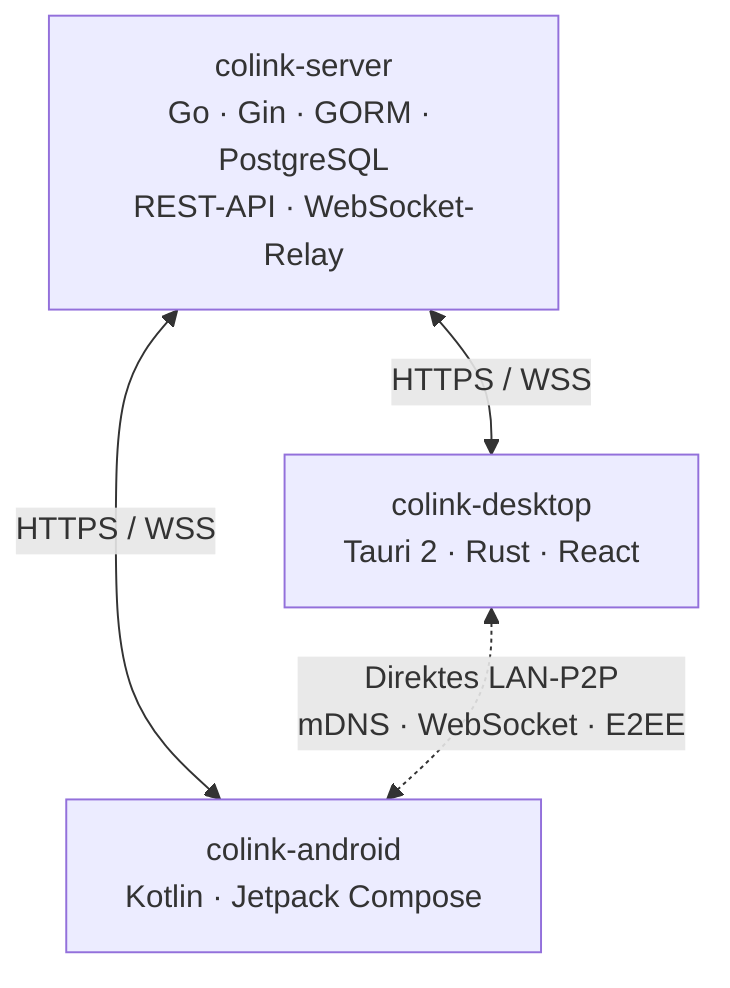

<!-- Generated from docs/readme/README.md.j2 and docs/readme/locales/*.yml. Run: uv run docs/readme/generate.py -->

<p align="center">
  
</p>
<p align="center">CoLink • Verbinde alle deine Geräte und arbeite nahtlos zusammen.</p>

<p align="center"><a href="README.md">English</a></p>
<p align="center">
  <a href="https://colinkdev.github.io/">Website</a> •
  <a href="#funktionen">Funktionen</a> •
  <a href="#schnellstart">Schnellstart</a> •
  <a href="#architektur">Architektur</a> •
  <a href="#entwicklung">Entwicklung</a>
</p>

---

CoLink ist ein plattformübergreifendes Werkzeug zur Gerätevernetzung, das alltägliche Synchronisierung, Fernzugriff und Gerätesteuerung über eine gemeinsame Verbindung vereint. Unabhängig davon, ob die Geräte im selben LAN oder über das Internet verbunden sind, können sie sicher zusammenarbeiten.

## Funktionen

- **Zwischenablage-Synchronisierung** — Auf einem Gerät kopieren, auf einem anderen einfügen. Unterstützt Klartext, Rich Text und Bilder.
- **Dateiübertragung** — Dateien zwischen Geräten senden. Direkte LAN-Übertragungen haben keine Größenbeschränkung; Cloud-Relay unterstützt bis zu 10 MB.
- **Textnachrichten** — Notizen und Textausschnitte sofort zwischen Geräten senden.
- **Remote-Dateizugriff** — Durchsuche das Dateisystem eines entfernten Geräts und übertrage Dateien zwischen verbundenen Geräten.
- **Remote-Terminal und Gerätesteuerung** — Öffne vom Smartphone aus ein interaktives Terminal auf einem verbundenen Computer; je nach Unterstützung des Gegenübers lassen sich Energiezustand, Medienwiedergabe und Systemlautstärke steuern.
- **Remote-Kamera** — Sieh dir Livevideo von Kameras verbundener Geräte an.
- **CastBoard** — Verwandle ein anderes Gerät in eine Live-Statusanzeige: Zeige aktuelle Wiedergabe, Albumcover und synchronisierte Liedtexte (NetEase Cloud Music, QQ Music, Sogou Music und Spotify) an und synchronisiere CPU-, Arbeitsspeicher-, Netzwerk- und weitere Systemwerte deines Computers.
- **Direkte LAN-Verbindung** — Geräte im selben Netzwerk finden sich automatisch per mDNS und verbinden sich direkt, vollständig ohne Cloud.

Funktionen für Fernzugriff und Steuerung hängen von Client-Version, Plattformfähigkeiten und den auf beiden Geräten gewährten Berechtigungen ab.

| Plattformunterstützung | App | Status |
|------|------|------|
| Windows | colink-desktop | ✅ Verfügbar |
| macOS | colink-desktop | 🚧 Bald verfügbar |
| Linux | colink-desktop | ✅ Verfügbar |
| Android | colink-android | ✅ Verfügbar |
| iOS | colink-ios | 🚧 Geplant |


## Oberflächenvorschau

| Geräteliste | Nachrichtenliste | Nachrichtenseite |
|:---:|:---:|:---:|
|  |  |  |

### CastBoard Demo

https://www.youtube.com/watch?v=w7pMdKMIfjg

<table>
  <tr>
    <td>Synchronisierte Liedtexte</td>
    <td></td>
  </tr>
  <tr>
    <td>Aktuelle Wiedergabe</td>
    <td></td>
  </tr>
  <tr>
    <td>Systemmetriken</td>
    <td></td>
  </tr>
</table>

## Schnellstart

### 1. Client installieren

| Plattform | Download |
|----------|----------|
| Windows | [Aktuelles Release](https://github.com/CoLinkDev/colink-desktop/releases/latest) |
| Linux | [Aktuelles Release](https://github.com/CoLinkDev/colink-desktop/releases/latest) |
| Android | [Aktuelles Release](https://github.com/CoLinkDev/colink-android/releases/latest) |


### 2. Verbinden

1. Öffne den Client und registriere ein Konto.
2. Kopple Geräte im selben LAN über den sechsstelligen Kopplungscode oder verbinde sie remote über das Server-Relay.
3. Starte die Zwischenablage-Synchronisierung, sende Dateien und Nachrichten oder nutze Fernzugriff, Gerätesteuerung und CastBoard.

### Self-Hosting (optional)

Du kannst den CoLink-Server mit Docker selbst hosten. Die Einrichtung ist unter [colink-server](https://github.com/CoLinkDev/colink-server) beschrieben.

## Architektur



| Kommunikationsweg | Transport | Zweck |
|------|----------|------|
| Client ↔ Server | HTTPS + WSS | Authentifizierung, Geräteverwaltung, Cloud-Relay |
| Client ↔ Client (LAN) | mDNS + WebSocket | Direktes P2P im selben Netzwerk |

## Sicherheit

- Jedes Gerät besitzt ein eigenes Ed25519-Schlüsselpaar als nicht fälschbare kryptografische Identität mit Unterstützung für Online-Rotation.
- LAN-Verbindungen bauen gegenseitiges Vertrauen über einen vierstufigen beidseitigen Handshake auf. Die Erstkopplung nutzt einen aus SHA-256 abgeleiteten sechsstelligen Kopplungscode gegen MITM-Angriffe.
- LAN-Nachrichten sind Ende-zu-Ende-verschlüsselt: X25519-ECDH-Schlüsselaustausch, aus HKDF-SHA256 abgeleitete Sitzungsschlüssel und AES-256-GCM/ChaCha20-Poly1305 AEAD.
- JWT Access Tokens sind 15 Minuten gültig. Refresh Tokens werden nach einmaliger Nutzung sofort rotiert, alte Tokens werden zur Replay-Erkennung widerrufen markiert.
- Der Server speichert keine Nachrichten, Dateien oder Zwischenablageinhalte dauerhaft, sondern nur Konto- und Geräte-Metadaten.

## Entwicklung

Dieses Projekt verwendet eine Multi-Repository-Struktur. Jede Komponente wird eigenständig gepflegt:

| Repository | Technologie | Beschreibung |
|------|--------|------|
| [colink-server](https://github.com/CoLinkDev/colink-server) | Go, Gin, GORM, PostgreSQL | Backend-API-Server und WebSocket-Relay |
| [colink-desktop](https://github.com/CoLinkDev/colink-desktop) | Tauri 2.x (Rust + React/TS) | Desktop-Client für Windows, macOS und Linux |
| [colink-android](https://github.com/CoLinkDev/colink-android) | Kotlin, Jetpack Compose | Android-Client |
| [colink-castboard](https://github.com/CoLinkDev/colink-castboard) | TypeScript | Eigenständiges CastBoard-Projekt |
| [CoLinkProtocol](https://github.com/CoLinkDev/CoLinkProtocol) | Markdown | Protokollspezifikationen und API-Dokumentation (gehostete Dokumentation: [CoLink Protocol](https://colinkdev.github.io/CoLinkProtocol/)) |

Klone das Haupt-Repository und alle Unter-Repositories in dasselbe übergeordnete Verzeichnis:

```bash
git clone https://github.com/CoLinkDev/CoLink.git
cd CoLink
git clone https://github.com/CoLinkDev/colink-server.git
git clone https://github.com/CoLinkDev/colink-desktop.git
git clone https://github.com/CoLinkDev/colink-android.git
git clone https://github.com/CoLinkDev/colink-castboard.git
git clone https://github.com/CoLinkDev/CoLinkProtocol.git
```

### Bauen und Ausführen

Jedes Unterprojekt hat eigene Einrichtungsanweisungen. Siehe die jeweilige README:

- **Server** — `colink-server/README.md`
- **Desktop** — `colink-desktop/README.md`
- **Android** — `colink-android/README.md`
- **CastBoard** — `colink-castboard/README.md`
