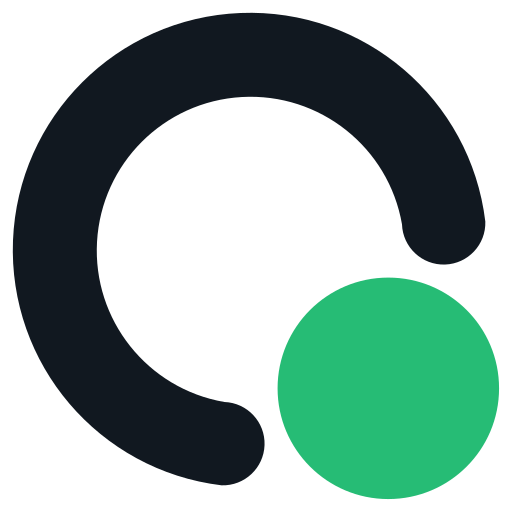
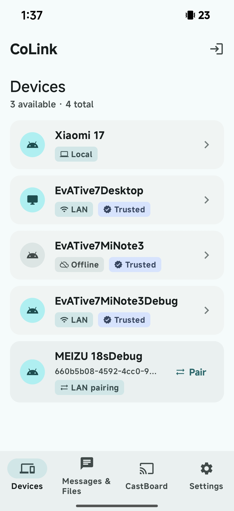
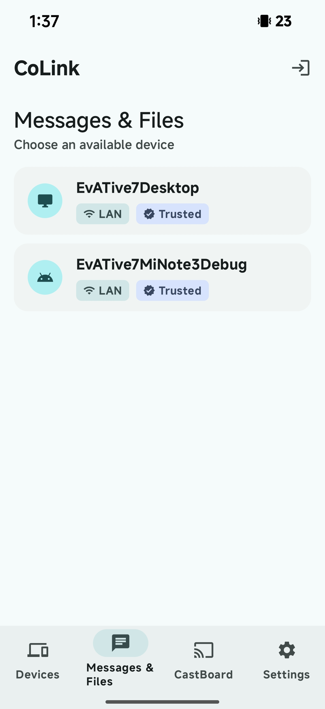
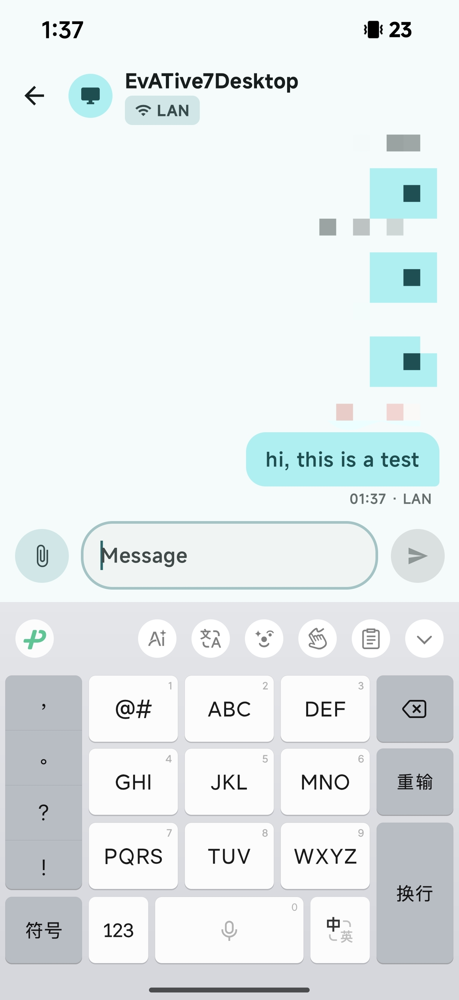
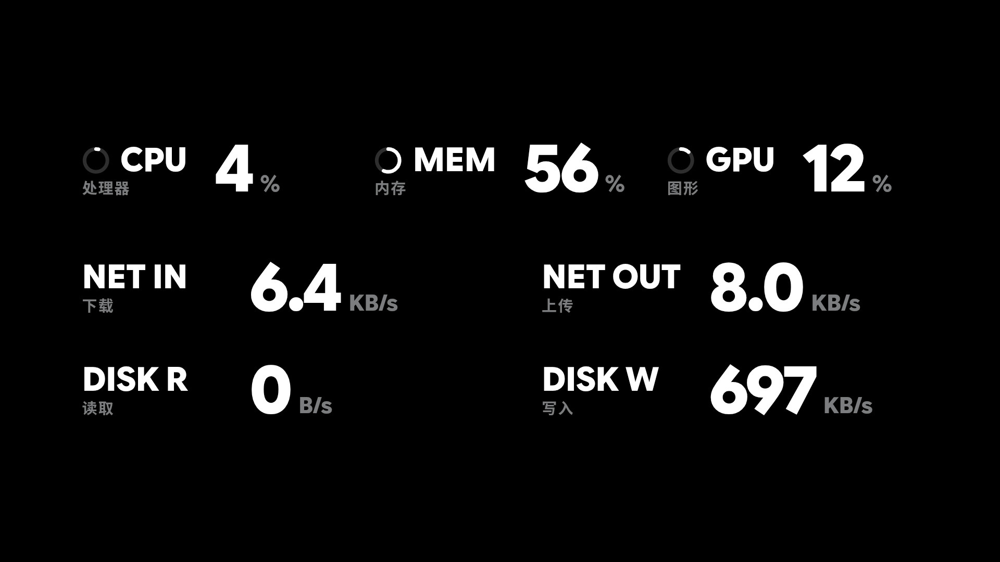

<p align="center">
  
</p>
<p align="center">
  <p align="center">CoLink • すべてのデバイスをつなぎ、シームレスに連携します。</p>
</p>

<p align="center">
  <a href="README.md">English</a> •
  <a href="https://colinkdev.github.io/">ウェブサイト</a> •
  <a href="#機能">機能</a> •
  <a href="#クイックスタート">クイックスタート</a> •
  <a href="#アーキテクチャ">アーキテクチャ</a> •
  <a href="#開発">開発</a>
</p>

---

CoLink は、日常的な同期、リモートアクセス、デバイス制御を一つの接続にまとめるクロスプラットフォームのデバイス連携ツールです。デバイスが同じ LAN 上にある場合でもインターネット経由で接続されている場合でも、安全に連携できます。

## 機能

- **クリップボード同期** — あるデバイスでコピーし、別のデバイスで貼り付けます。プレーンテキスト、リッチテキスト、画像に対応しています。
- **ファイル転送** — デバイス間でファイルを送信します。LAN 直結転送にはサイズ制限がなく、クラウドリレーは最大 10 MB まで対応します。
- **テキストメッセージ** — メモやテキスト断片をデバイス間で即座に送信できます。
- **リモートファイルアクセス** — リモートデバイスのファイルシステムを閲覧し、接続済みデバイス間でファイルを転送できます。
- **リモートターミナルとデバイス制御** — スマートフォンから接続済みコンピューターの対話型ターミナルを開き、接続先の対応状況に応じて電源状態、メディア再生、システム音量を制御できます。
- **リモートカメラ** — 接続済みデバイスのカメラ映像をライブで確認できます。
- **CastBoard** — 別のデバイスをライブステータス表示に変えます。現在の再生情報、アルバムアート、同期歌詞（NetEase Cloud Music、QQ Music、Sogou Music、Spotify）を表示し、コンピューターの CPU、メモリ、ネットワークなどのシステム指標を同期します。
- **LAN 直結** — 同じネットワーク上のデバイスは mDNS で自動検出され、クラウドを経由せず直接接続します。

リモートアクセスと制御の機能は、両方のデバイスのクライアントバージョン、プラットフォーム機能、付与された権限に依存します。

| 対応プラットフォーム | アプリ | 状態 |
|------|------|------|
| Windows  | colink-desktop | ✅ 利用可能 |
| macOS    | colink-desktop | 🚧 近日対応 |
| Linux    | colink-desktop | ✅ 利用可能 |
| Android  | colink-android | ✅ 利用可能 |
| iOS      | colink-ios     | 🚧 計画中 |

## 画面プレビュー

| デバイス一覧 | メッセージ一覧 | メッセージ画面 |
|:---:|:---:|:---:|
|  |  |  |

### CastBoard Demo

https://www.youtube.com/watch?v=w7pMdKMIfjg

<table>
  <tr>
    <td>同期歌詞</td>
    <td></td>
  </tr>
  <tr>
    <td>現在の再生</td>
    <td></td>
  </tr>
  <tr>
    <td>システム指標</td>
    <td></td>
  </tr>
</table>

## クイックスタート

### 1. クライアントをインストール

| プラットフォーム | ダウンロード |
|----------|----------|
| Windows | [最新リリース](https://github.com/CoLinkDev/colink-desktop/releases/latest) |
| Linux | [最新リリース](https://github.com/CoLinkDev/colink-desktop/releases/latest) |
| Android | [最新リリース](https://github.com/CoLinkDev/colink-android/releases/latest) |

### 2. 接続

1. クライアントを開いてアカウントを登録します。
2. 同じ LAN 上では 6 桁のペアリングコードでデバイスをペアリングし、リモートではサーバーリレー経由で接続します。
3. クリップボードを同期し、ファイルやメッセージを送信するか、リモートアクセス、デバイス制御、CastBoard を利用します。

### セルフホスティング（任意）

Docker を使って CoLink サーバーをセルフホストできます。セットアップ手順は [colink-server](https://github.com/CoLinkDev/colink-server) を参照してください。

## アーキテクチャ

```
                        ┌─────────────────────┐
                        │   colink-server     │
                        │   (Go / Gin)        │
                        │   REST + WS Relay   │
                        └────────┬────────────┘
                                 │
               HTTPS / WSS       │       HTTPS / WSS
        ┌────────────────────────┼────────────────────────┐
        │                        │                        │
        ▼                        ▼                        ▼
┌───────────────┐      ┌────────────────┐       ┌─────────────────┐
│ colink-desktop│      │ colink-android │       │ colink-frontend │
│ Tauri 2.x     │      │ Kotlin/Compose │       │ Vue 3 Web App   │
│ Win/Mac/Linux │      │ Android        │       │ アカウント管理   │
└───────┬───────┘      └───────┬────────┘       └─────────────────┘
        │                      │
        │  LAN (mDNS + WS)     │
        └──────────────────────┘
```

| 通信経路 | 転送方式 | 用途 |
|------|----------|------|
| クライアント ↔ サーバー | HTTPS + WSS | 認証、デバイス管理、クラウドリレー |
| クライアント ↔ クライアント（LAN） | mDNS + WebSocket | 同一ネットワーク内の直接 P2P |
| フロントエンド ↔ サーバー | HTTPS | アカウント管理 |

## セキュリティ

- 各デバイスは偽造できない暗号学的 ID として独立した Ed25519 鍵ペアを持ち、オンラインでのローテーションに対応しています。
- LAN 接続は 4 ステップの相互ハンドシェイクで信頼を確立します。初回ペアリングでは MITM 攻撃を防ぐため、SHA-256 から派生した 6 桁のペアリングコードを使用します。
- LAN メッセージはエンドツーエンドで暗号化されます。X25519 ECDH 鍵合意、HKDF-SHA256 派生セッション鍵、AES-256-GCM/ChaCha20-Poly1305 AEAD を使用します。
- JWT Access Token の有効期間は 15 分です。Refresh Token は 1 回の使用後すぐにローテーションされ、古いトークンはリプレイ検出のため失効済みとして記録されます。
- サーバーはメッセージ、ファイル、クリップボード内容を永続化せず、アカウントとデバイスのメタデータのみを保存します。

## 開発

このプロジェクトはマルチリポジトリ構成です。各コンポーネントは独立して管理されています。

| リポジトリ | 技術スタック | 説明 |
|------|--------|------|
| [colink-server](https://github.com/CoLinkDev/colink-server) | Go, Gin, GORM, PostgreSQL | バックエンド API サーバーと WebSocket リレー |
| [colink-desktop](https://github.com/CoLinkDev/colink-desktop) | Tauri 2.x (Rust + React/TS) | Windows、macOS、Linux 向けデスクトップクライアント |
| [colink-android](https://github.com/CoLinkDev/colink-android) | Kotlin, Jetpack Compose | Android クライアント |
| [colink-frontend](https://github.com/CoLinkDev/colink-frontend) | Vue 3, TypeScript | アカウントとセッション管理の Web フロントエンド |
| [CoLinkProtocol](https://github.com/CoLinkDev/CoLinkProtocol) | Markdown | プロトコル仕様と API ドキュメント（ホストされたドキュメント: [CoLink Protocol](https://colinkdev.github.io/CoLinkProtocol/)） |

ルートリポジトリとすべてのサブリポジトリを同じ親ディレクトリにクローンします。

```bash
git clone https://github.com/CoLinkDev/CoLink.git
cd CoLink
git clone https://github.com/CoLinkDev/colink-server.git
git clone https://github.com/CoLinkDev/colink-desktop.git
git clone https://github.com/CoLinkDev/colink-android.git
git clone https://github.com/CoLinkDev/colink-frontend.git
git clone https://github.com/CoLinkDev/CoLinkProtocol.git
```

### ビルドと実行

各サブプロジェクトにはそれぞれ設定手順があります。対応する README を参照してください。

- **サーバー** — `colink-server/README.md`
- **デスクトップ** — `colink-desktop/README.md`
- **Android** — `colink-android/README.md`
- **フロントエンド** — `colink-frontend/README.md`
