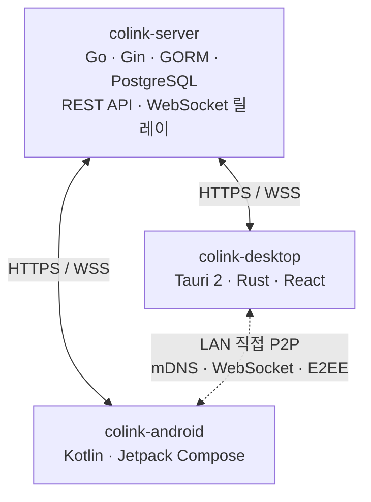

<!-- Generated from docs/readme/README.md.j2 and docs/readme/locales/*.yml. Run: uv run docs/readme/generate.py -->

<p align="center">
  
</p>
<p align="center">CoLink • 모든 기기를 연결해 끊김 없이 협업합니다.</p>

<p align="center"><a href="README.md">English</a></p>
<p align="center">
  <a href="https://colinkdev.github.io/">웹사이트</a> •
  <a href="#기능">기능</a> •
  <a href="#빠른-시작">빠른 시작</a> •
  <a href="#아키텍처">아키텍처</a> •
  <a href="#개발">개발</a>
</p>

---

CoLink은 일상적인 동기화, 원격 액세스, 기기 제어를 하나의 연결로 통합하는 크로스플랫폼 기기 연결 도구입니다. 기기가 같은 LAN에 있거나 인터넷을 통해 연결되어 있어도 안전하게 협업할 수 있습니다.

## 기능

- **클립보드 동기화** — 한 기기에서 복사하고 다른 기기에서 붙여넣습니다. 일반 텍스트, 리치 텍스트, 이미지를 지원합니다.
- **파일 전송** — 기기 사이에서 파일을 보냅니다. LAN 직접 전송에는 크기 제한이 없으며, 클라우드 릴레이는 최대 10 MB를 지원합니다.
- **텍스트 메시지** — 메모와 텍스트 조각을 기기 사이에서 즉시 보냅니다.
- **원격 파일 액세스** — 원격 기기의 파일 시스템을 탐색하고 연결된 기기 간에 파일을 전송합니다.
- **원격 터미널 및 기기 제어** — 휴대폰에서 연결된 컴퓨터의 대화형 터미널을 열고, 상대 기기 지원 여부에 따라 전원 상태, 미디어 재생, 시스템 볼륨을 제어합니다.
- **원격 카메라** — 연결된 기기의 카메라 영상을 실시간으로 확인합니다.
- **CastBoard** — 다른 기기를 실시간 상태 화면으로 바꿉니다. 현재 재생 정보, 앨범 아트, 동기화 가사(NetEase Cloud Music, QQ Music, Sogou Music, Spotify)를 표시하고 컴퓨터의 CPU, 메모리, 네트워크 등 시스템 지표를 동기화합니다.
- **LAN 직접 연결** — 같은 네트워크의 기기는 mDNS로 자동 발견되고 클라우드를 거치지 않고 직접 연결됩니다.

원격 액세스와 제어 기능은 양쪽 기기의 클라이언트 버전, 플랫폼 기능, 부여된 권한에 따라 달라집니다.

| 지원 플랫폼 | 앱 | 상태 |
|------|------|------|
| Windows | colink-desktop | ✅ 사용 가능 |
| macOS | colink-desktop | 🚧 곧 제공 |
| Linux | colink-desktop | ✅ 사용 가능 |
| Android | colink-android | ✅ 사용 가능 |
| iOS | colink-ios | 🚧 계획 중 |


## 화면 미리보기

| 기기 목록 | 메시지 목록 | 메시지 화면 |
|:---:|:---:|:---:|
|  |  |  |

### CastBoard Demo

https://www.youtube.com/watch?v=w7pMdKMIfjg

<table>
  <tr>
    <td>동기화 가사</td>
    <td></td>
  </tr>
  <tr>
    <td>현재 재생</td>
    <td></td>
  </tr>
  <tr>
    <td>시스템 지표</td>
    <td></td>
  </tr>
</table>

## 빠른 시작

### 1. 클라이언트 설치

| 플랫폼 | 다운로드 |
|----------|----------|
| Windows | [최신 릴리스](https://github.com/CoLinkDev/colink-desktop/releases/latest) |
| Linux | [최신 릴리스](https://github.com/CoLinkDev/colink-desktop/releases/latest) |
| Android | [최신 릴리스](https://github.com/CoLinkDev/colink-android/releases/latest) |


### 2. 연결

1. 클라이언트를 열고 계정을 등록합니다.
2. 같은 LAN에서는 6자리 페어링 코드로 기기를 페어링하거나, 서버 릴레이를 통해 원격으로 연결합니다.
3. 클립보드를 동기화하고 파일과 메시지를 보내거나, 원격 액세스, 기기 제어, CastBoard를 사용합니다.

### 셀프 호스팅(선택 사항)

Docker로 CoLink 서버를 직접 호스팅할 수 있습니다. 설정 방법은 [colink-server](https://github.com/CoLinkDev/colink-server)를 참고하세요.

## 아키텍처


```mermaid
flowchart TB
  Server["colink-server<br/>Go · Gin · GORM · PostgreSQL<br/>REST API · WebSocket 릴레이"]
  Desktop["colink-desktop<br/>Tauri 2 · Rust · React"]
  Android["colink-android<br/>Kotlin · Jetpack Compose"]

  Server <-->|HTTPS / WSS| Desktop
  Server <-->|HTTPS / WSS| Android
  Desktop <-.->|LAN 직접 P2P<br/>mDNS · WebSocket · E2EE| Android
```

| 통신 경로 | 전송 방식 | 용도 |
|------|----------|------|
| 클라이언트 ↔ 서버 | HTTPS + WSS | 인증, 기기 관리, 클라우드 릴레이 |
| 클라이언트 ↔ 클라이언트(LAN) | mDNS + WebSocket | 같은 네트워크에서 직접 P2P |

## 보안

- 각 기기는 위조할 수 없는 암호학적 신원으로 독립된 Ed25519 키 쌍을 보유하며, 온라인 회전을 지원합니다.
- LAN 연결은 4단계 양방향 핸드셰이크로 상호 신뢰를 설정합니다. 최초 페어링은 MITM을 방지하기 위해 SHA-256에서 파생한 6자리 페어링 코드를 사용합니다.
- LAN 메시지는 종단 간 암호화됩니다. X25519 ECDH 키 합의, HKDF-SHA256 파생 세션 키, AES-256-GCM/ChaCha20-Poly1305 AEAD를 사용합니다.
- JWT Access Token은 15분 동안 유효합니다. Refresh Token은 1회 사용 직후 회전되며, 이전 토큰은 재사용 공격 감지를 위해 폐기 표시됩니다.
- 서버는 메시지, 파일, 클립보드 내용을 영구 저장하지 않고 계정 및 기기 메타데이터만 저장합니다.

## 개발

이 프로젝트는 다중 저장소 구조를 사용합니다. 각 구성 요소는 독립적으로 유지 관리됩니다.

| 저장소 | 기술 스택 | 설명 |
|------|--------|------|
| [colink-server](https://github.com/CoLinkDev/colink-server) | Go, Gin, GORM, PostgreSQL | 백엔드 API 서버와 WebSocket 릴레이 |
| [colink-desktop](https://github.com/CoLinkDev/colink-desktop) | Tauri 2.x (Rust + React/TS) | Windows, macOS, Linux용 데스크톱 클라이언트 |
| [colink-android](https://github.com/CoLinkDev/colink-android) | Kotlin, Jetpack Compose | Android 클라이언트 |
| [colink-castboard](https://github.com/CoLinkDev/colink-castboard) | TypeScript | 독립형 CastBoard 프로젝트 |
| [CoLinkProtocol](https://github.com/CoLinkDev/CoLinkProtocol) | Markdown | 프로토콜 사양과 API 문서(호스팅 문서: [CoLink Protocol](https://colinkdev.github.io/CoLinkProtocol/)) |

루트 저장소와 모든 하위 저장소를 같은 상위 디렉터리에 클론합니다.

```bash
git clone https://github.com/CoLinkDev/CoLink.git
cd CoLink
git clone https://github.com/CoLinkDev/colink-server.git
git clone https://github.com/CoLinkDev/colink-desktop.git
git clone https://github.com/CoLinkDev/colink-android.git
git clone https://github.com/CoLinkDev/colink-castboard.git
git clone https://github.com/CoLinkDev/CoLinkProtocol.git
```

### 빌드 및 실행

각 하위 프로젝트에는 자체 설정 안내가 있습니다. 해당 README를 참고하세요.

- **서버** — `colink-server/README.md`
- **데스크톱** — `colink-desktop/README.md`
- **Android** — `colink-android/README.md`
- **CastBoard** — `colink-castboard/README.md`
