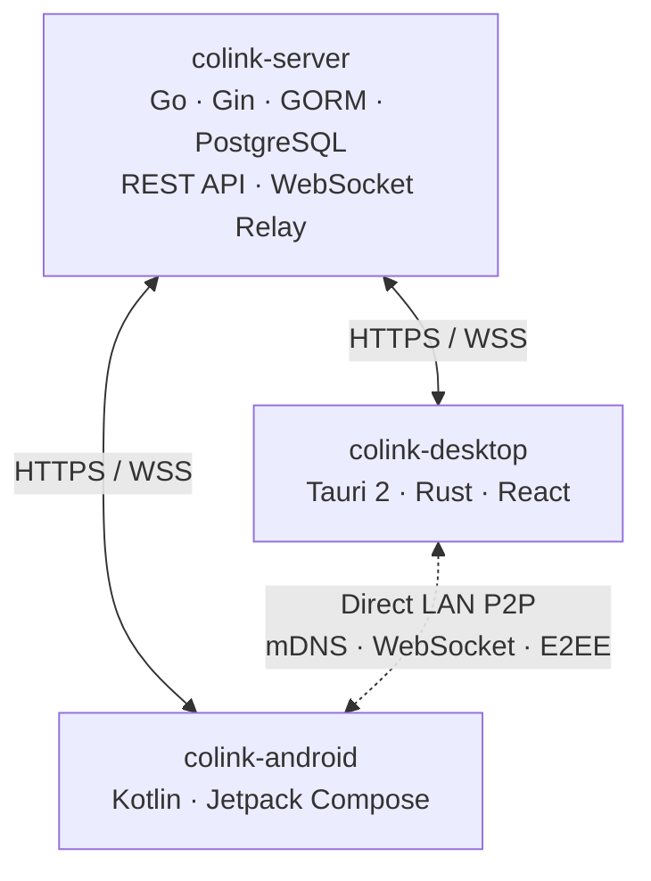

<!-- Generated from docs/readme/README.md.j2 and docs/readme/locales/*.yml. Run: uv run docs/readme/generate.py -->

<p align="center">
  
</p>
<p align="center">CoLink • Connect all your devices for seamless collaboration.</p>

<p align="center"><a href="README.md">English</a> • <a href="README.zhcn.md">简体中文</a> • <a href="README.ja.md">日本語</a> • <a href="README.ko.md">한국어</a> • <a href="README.zhtw.md">繁體中文</a> • <a href="README.de.md">Deutsch</a> • <a href="README.es.md">Español</a> • <a href="README.ru.md">Русский</a></p>
<p align="center">
  <a href="https://colinkdev.github.io/">Website</a> •
  <a href="#features">Features</a> •
  <a href="#quickstart">Quick Start</a> •
  <a href="#architecture">Architecture</a> •
  <a href="#development">Development</a>
</p>

---

CoLink is a cross-platform device connectivity tool that brings everyday sync, remote access, and device control together through a single connection. Whether devices are on the same LAN or connected over the internet, they can collaborate securely.

## Features

- **Clipboard Sync** — Copy on one device and paste on another. Supports plain text, rich text, and images.
- **File Transfer** — Send files between devices. Direct LAN transfers have no size limit; cloud relay supports up to 10 MB.
- **Text Messages** — Send notes and text snippets between devices instantly.
- **Remote File Access** — Browse the file system of a remote device and transfer files between connected devices.
- **Remote Terminal & Device Control** — Open an interactive terminal on a connected computer from your phone; depending on peer support, control power state, media playback, and system volume.
- **Remote Camera** — View live video from cameras on connected devices.
- **CastBoard** — Turn another device into a live status display: show now-playing information, album art, and synchronized lyrics (NetEase Cloud Music, QQ Music, Sogou Music, and Spotify), and sync CPU, memory, network, and other system metrics from your computer.
- **Direct LAN Connection** — Devices on the same network discover each other automatically through mDNS and connect directly without going through the cloud.

Remote access and control features depend on the client version, platform capabilities, and granted permissions on both devices.

| Platform Support | App | Status |
|------|------|------|
| Windows | colink-desktop | ✅ Available |
| macOS | colink-desktop | 🚧 Coming soon |
| Linux | colink-desktop | ✅ Available |
| Android | colink-android | ✅ Available |
| iOS | colink-ios | 🚧 Planned |


## Interface Preview

| Device List | Message List | Message Page |
|:---:|:---:|:---:|
|  |  |  |

### CastBoard Demo

https://www.youtube.com/watch?v=w7pMdKMIfjg

<table>
  <tr>
    <td>Synchronized Lyrics</td>
    <td></td>
  </tr>
  <tr>
    <td>Now Playing</td>
    <td></td>
  </tr>
  <tr>
    <td>System Metrics</td>
    <td></td>
  </tr>
</table>

## Quick Start

### 1. Install a Client

| Platform | Download |
|----------|----------|
| Windows | [Latest Release](https://github.com/CoLinkDev/colink-desktop/releases/latest) |
| Linux | [Latest Release](https://github.com/CoLinkDev/colink-desktop/releases/latest) |
| Android | [Latest Release](https://github.com/CoLinkDev/colink-android/releases/latest) |


### 2. Connect

1. Open the client and sign up.
2. Pair devices on the same LAN via the 6-digit pairing code, or connect remotely through the server relay.
3. Start syncing clipboard, sending files and messages, or using remote access, device control, and CastBoard.

### Self-hosting (Optional)

You can self-host the CoLink server using Docker. See [colink-server](https://github.com/CoLinkDev/colink-server) for setup instructions.

## Architecture



| Communication Path | Transport | Purpose |
|------|----------|------|
| Client ↔ Server | HTTPS + WSS | Authentication, device management, cloud relay |
| Client ↔ Client (LAN) | mDNS + WebSocket | Direct P2P on the same network |

## Security

- Each device has its own Ed25519 key pair as a non-forgeable cryptographic identity, with online rotation support.
- LAN connections establish mutual trust through a four-step mutual handshake. First-time pairing uses a SHA-256-derived 6-digit pairing code to prevent MITM attacks.
- LAN messages are end-to-end encrypted with X25519 ECDH key agreement, HKDF-SHA256 session keys, and AES-256-GCM/ChaCha20-Poly1305 AEAD.
- JWT access tokens are valid for 15 minutes. Refresh tokens are rotated immediately after single use, and old tokens are marked revoked to detect replay.
- The server does not persist messages, files, or clipboard contents. It only stores account and device metadata.

## Development

This project uses a multi-repository structure. Each component is maintained independently:

| Repository | Tech Stack | Description |
|------|--------|------|
| [colink-server](https://github.com/CoLinkDev/colink-server) | Go, Gin, GORM, PostgreSQL | Backend API server and WebSocket relay |
| [colink-desktop](https://github.com/CoLinkDev/colink-desktop) | Tauri 2.x (Rust + React/TS) | Desktop client for Windows, macOS, and Linux |
| [colink-android](https://github.com/CoLinkDev/colink-android) | Kotlin, Jetpack Compose | Android client |
| [colink-castboard](https://github.com/CoLinkDev/colink-castboard) | TypeScript | Standalone CastBoard project |
| [CoLinkProtocol](https://github.com/CoLinkDev/CoLinkProtocol) | Markdown | Protocol specifications and API documentation (hosted documentation: [CoLink Protocol](https://colinkdev.github.io/CoLinkProtocol/)) |

Clone the root repository and all sub-repositories into the same parent directory:

```bash
git clone https://github.com/CoLinkDev/CoLink.git
cd CoLink
git clone https://github.com/CoLinkDev/colink-server.git
git clone https://github.com/CoLinkDev/colink-desktop.git
git clone https://github.com/CoLinkDev/colink-android.git
git clone https://github.com/CoLinkDev/colink-castboard.git
git clone https://github.com/CoLinkDev/CoLinkProtocol.git
```

### Build and Run

Each sub-project has its own setup instructions. See the corresponding README:

- **Server** — `colink-server/README.md`
- **Desktop** — `colink-desktop/README.md`
- **Android** — `colink-android/README.md`
- **CastBoard** — `colink-castboard/README.md`
